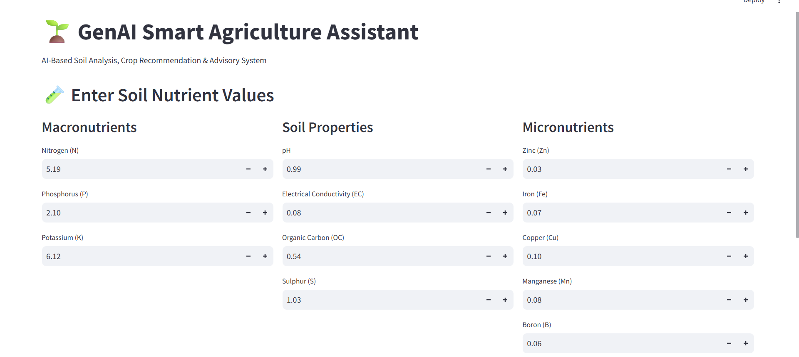
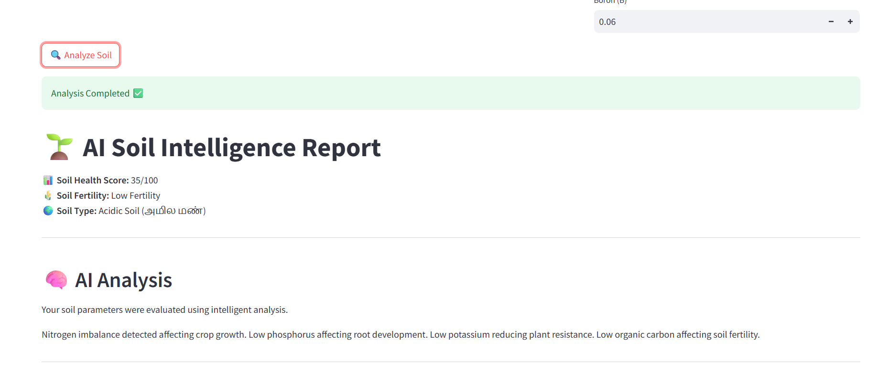
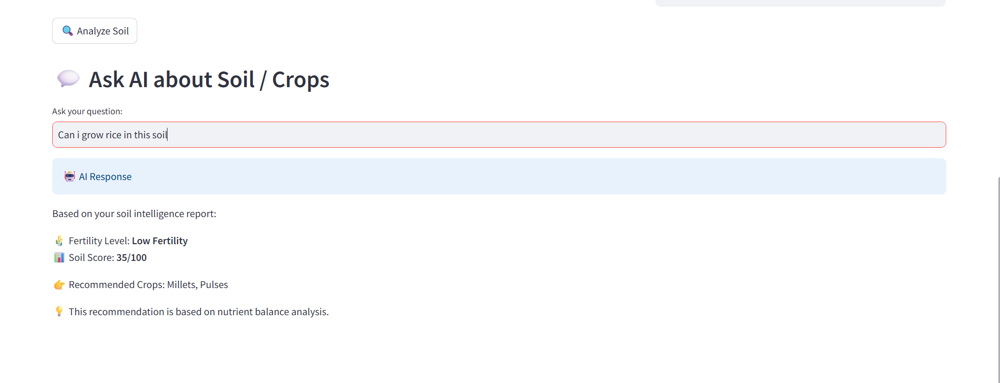

# Gen-AI-project1
# Soil-Health Storyteller (GenAI Smart Agriculture Assistant)

## Project Overview
Soil-Health Storyteller is an AI-based smart agriculture system that analyzes soil nutrient data and provides crop recommendations and soil health insights. The system converts raw soil data into meaningful and easy-to-understand reports for better farming decisions.

## Features
- Soil nutrient analysis (N, P, K, pH, OC)
- Soil fertility prediction
- Rule-based explanation system
- Soil health scoring mechanism
- Crop recommendation system
- AI-style advisory report generation
- Interactive chatbot for user queries
- Streamlit web interface

## Technologies Used
- Python
- Streamlit
- Machine Learning (Random Forest Model)
- Rule-Based Logic System
- Pandas / NumPy
- Pickle (model storage)

## Workflow
1. User enters soil parameters
2. Data is processed and analyzed
3. ML model predicts soil condition
4. Rule-based system generates explanation
5. Soil health score is calculated
6. Crop recommendation is generated
7. AI-style report is displayed
8. Chatbot answers user queries


## System Architecture
Input → Processing → ML Model → Rule Engine → Scoring → Recommendation → Output Report → Chatbot

## 📸 Outputs / Results

### 🔹 Soil Input Interface


### 🔹 AI Soil Report


### 🔹 Chatbot Interaction



## How to Run
```bash
pip install -r requirements.txt
streamlit run app.py
